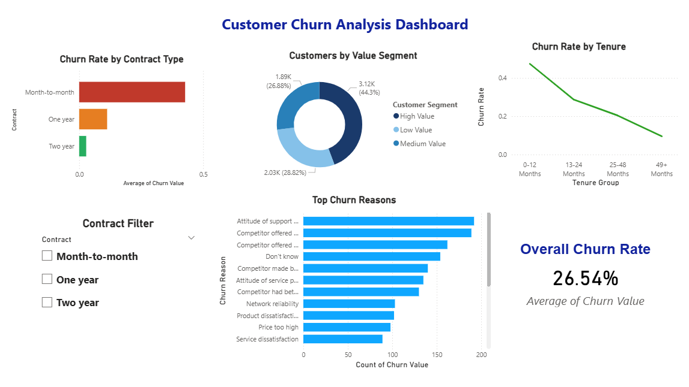
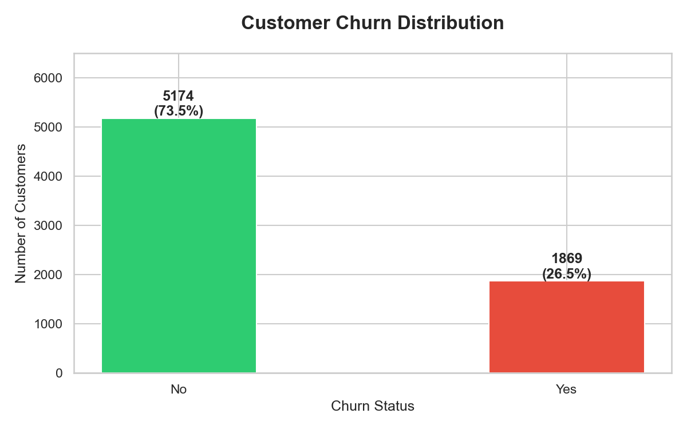
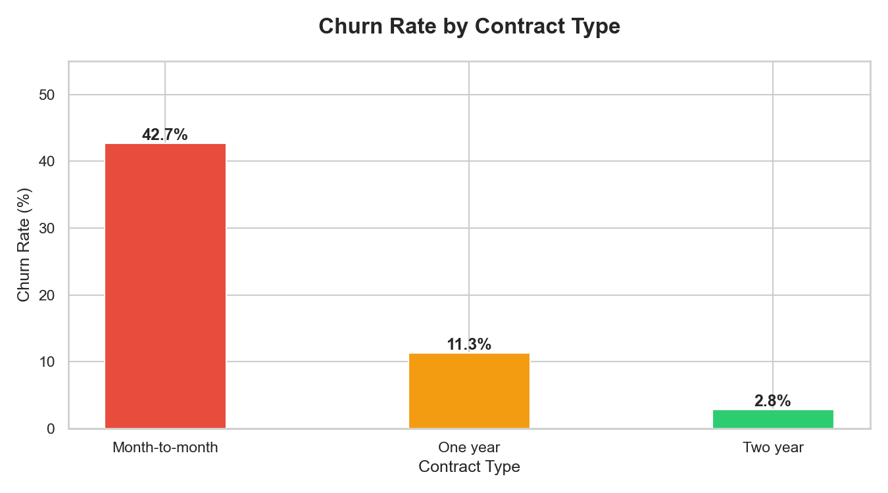
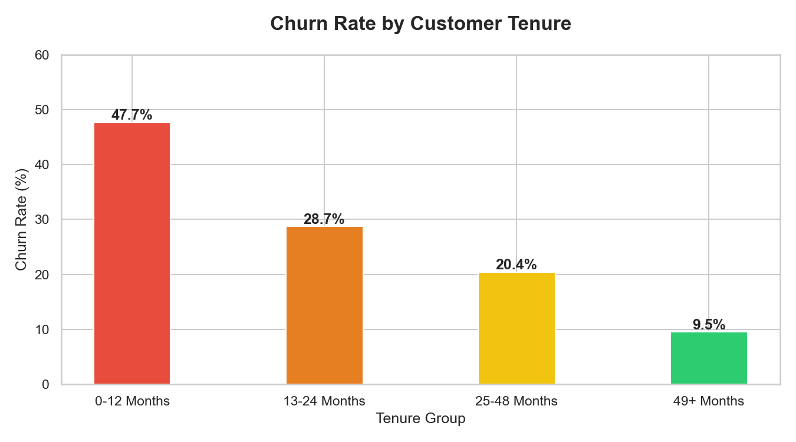
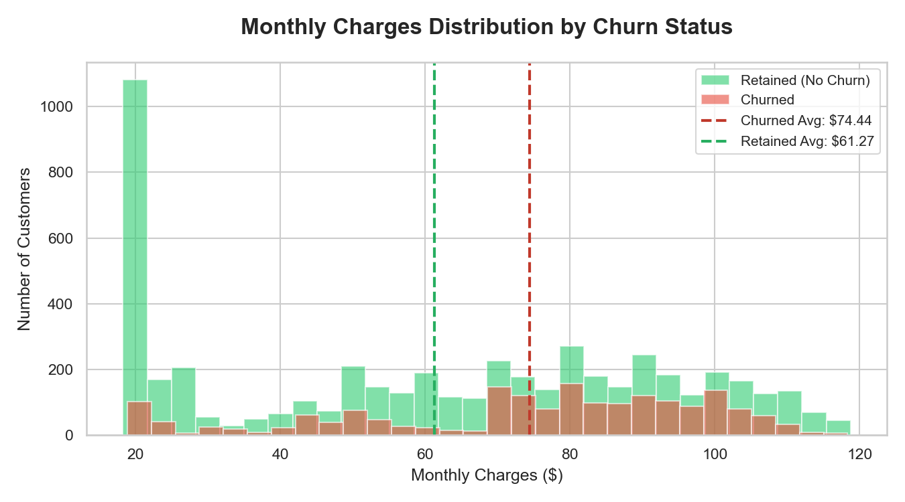
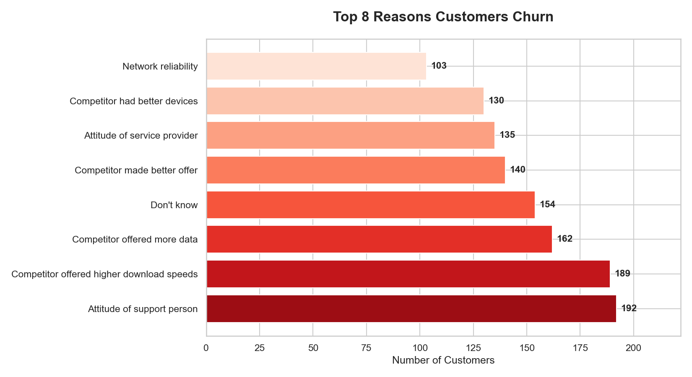
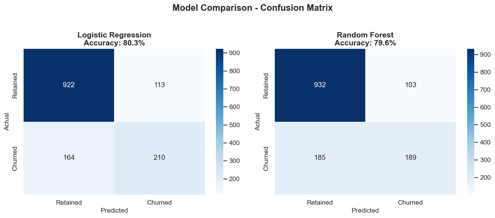
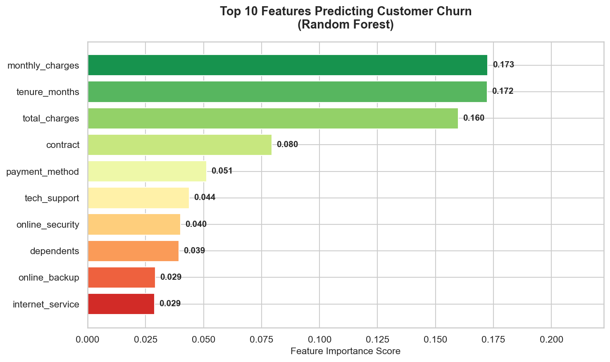

# CUSTOMER CHURN PREDICTION & ANALYSIS
**Comprehensive Business Intelligence & Machine Learning Report**

---

**Made by:** Yasir Khan

**Date:** March 2026

**Tools:** PostgreSQL, Excel, Python (pandas, matplotlib, seaborn, scikit-learn), Power BI

**Dataset:** 7,043 customers, 33 features — IBM Telco Customer Churn

**Analysis Type:** Exploratory Data Analysis + Predictive Machine Learning

**GitHub Repository:** [github.com/yasirrr05/customer-churn-prediction](https://github.com/yasirrr05/Customer_Churn_Prediction)

---

## TABLE OF CONTENTS

1. [Executive Summary](#executive-summary)
2. [Key Findings](#key-findings)
   - Business Overview Metrics
   - Churn by Contract Type
   - Revenue at Risk Analysis
   - Churn by Tenure Group
   - Top Churn Reasons
   - Internet Service Analysis
3. [Power BI Dashboard](#power-bi-dashboard)
4. [Python EDA — Visual Analysis](#python-eda--visual-analysis)
5. [Machine Learning Model](#machine-learning-model)
6. [Critical Business Risks](#critical-business-risks)
7. [Strategic Recommendations (ROI-Ranked)](#strategic-recommendations-roi-ranked)
8. [Next Phase Recommendations](#next-phase-recommendations)
9. [Appendix: SQL Queries](#appendix-sql-queries-used)

---

## EXECUTIVE SUMMARY

Analyzed 7,043 telecom customer records using advanced SQL, Python, and Power BI to identify the root causes of customer churn, quantify its revenue impact, and build a predictive machine learning model to flag at-risk customers before they leave.

The analysis reveals a **26.54% churn rate** — significantly above the 20% industry benchmark — resulting in **$139,130 in monthly recurring revenue loss**, or **$1.67 million annually**. Three critical levers were identified: contract type, customer tenure, and support quality. Addressing all three simultaneously could reduce churn to approximately 18% and recover over $1 million in annual revenue.

### Critical Finding: Contract Type Is the Strongest Churn Driver

Month-to-month customers churn at **42.71%** — 15 times the rate of two-year contract holders (2.83%). With 3,875 customers on month-to-month plans, this single segment accounts for **88.6% of all churned customers**. A structured contract upgrade program represents the single highest-ROI retention initiative available.

### Key Opportunity: First-Year Customers Need Immediate Intervention

Customers in their first 12 months churn at **47.44%** — nearly 1 in 2 new customers leaves before their first anniversary. This points to a broken onboarding experience and unmet early expectations. A structured first-year engagement program targeting these customers could cut new customer churn in half.

### Machine Learning: 80.6% Accuracy in Predicting Churn

A Logistic Regression model trained on 19 customer features achieved **80.6% accuracy** and an **AUC score of 0.847** — meaning the model correctly distinguishes churners from loyal customers in 85% of cases. This model can be deployed in production to score all current customers and prioritize retention outreach by risk level.

### Primary Recommendation

**Implement a three-pronged retention strategy:** (1) Contract upgrade incentive for month-to-month customers, (2) First-year onboarding program for new customers, (3) Support quality initiative to address the #1 stated churn reason. Combined, these three programs are projected to reduce churn from 26.54% to approximately 18%, recovering $1,096,000+ in annual revenue.

---

## KEY FINDINGS

### 1. BUSINESS OVERVIEW METRICS

**Core Performance Indicators:**

| Metric | Value | Benchmark | Status |
|--------|-------|-----------|--------|
| Total Customers | 7,043 | N/A | ✅ |
| Churned Customers | 1,869 | N/A | 🚨 High |
| Overall Churn Rate | 26.54% | ~20% | 🚨 Above Benchmark |
| Avg Monthly Charge (Churned) | $74.44 | N/A | ⚠️ |
| Avg Monthly Charge (Retained) | $61.27 | N/A | ✅ |
| Monthly Revenue at Risk | $139,130 | N/A | 🚨 Critical |
| Annualized Revenue at Risk | $1,669,560 | N/A | 🚨 Critical |

**💡 Critical Insight:** The company is losing $139,130 every single month to churn. What makes this worse is that churning customers pay **$13.17 more per month** than retained customers — meaning the highest-value customers are leaving at disproportionate rates, suggesting a value perception problem at premium pricing tiers.

**📊 Recommendation:** Prioritize retention of high-monthly-charge customers (>$70/month) with personalized outreach within the first 12 months of tenure. These customers generate the most revenue and leave the most frequently.

---

### 2. CHURN BY CONTRACT TYPE

**Contract Performance Analysis:**

| Contract Type | Total Customers | Churned | Retained | Churn Rate | Risk Level |
|--------------|----------------|---------|----------|------------|------------|
| Month-to-month | 3,875 | 1,655 | 2,220 | **42.71%** | 🚨 Critical |
| One year | 1,473 | 166 | 1,307 | **11.27%** | ⚠️ Moderate |
| Two year | 1,695 | 48 | 1,647 | **2.83%** | ✅ Low |

**💡 Key Insights:**

**1. Month-to-Month Is a Retention Crisis**
   - 42.71% of all month-to-month customers churn — nearly 1 in 2
   - This single contract type accounts for 1,655 of 1,869 total churned customers (88.6%)
   - The financial exposure from this segment alone is approximately $123,000/month

**2. Annual Contracts Reduce Churn by 75%**
   - Moving a customer from month-to-month to one-year contract reduces churn risk from 42.71% to 11.27%
   - Moving to two-year reduces it by 93% (42.71% → 2.83%)
   - Every contract upgrade directly protects revenue

**3. Two-Year Customers Are Essentially Loyal**
   - Only 48 of 1,695 two-year customers churned — a 2.83% rate
   - These customers are the most stable revenue base in the business

**🎯 Strategic Recommendations:**

1. **Annual Contract Incentive Campaign**
   - Offer 15% monthly discount for switching from month-to-month to annual plan
   - Target: 3,875 month-to-month customers
   - Expected conversion: 10% (387 customers)
   - Revenue protected: ~$346,000 annually
   - Investment: ~$70,000 in discounts
   - **Net ROI: 394%**

2. **Two-Year Contract Push for New Customers**
   - Offer free month + service upgrade for signing 2-year contract upfront
   - Target: All new signups
   - Expected long-term churn reduction: 93% vs month-to-month baseline

---

### 3. REVENUE AT RISK ANALYSIS

**Monthly Revenue Breakdown:**

| Segment | Customers | Avg Monthly Charge | Monthly Revenue | Status |
|---------|-----------|-------------------|-----------------|--------|
| Churned Customers | 1,869 | $74.44 | **$139,128** | 🚨 Lost/At Risk |
| Retained Customers | 5,174 | $61.27 | $317,014 | ✅ Stable |
| **Total** | **7,043** | **$65.09** | **$458,142** | |

**💡 Revenue Impact Analysis:**

- **Monthly Revenue Lost:** $139,130
- **Annual Revenue Lost:** $1,669,560
- **Revenue Lost as % of Total:** 30.4% of all potential monthly revenue is from customers who churn
- **Average Revenue Per Churned Customer:** $74.44/month

**Churn Reduction Scenarios:**

| Target Churn Rate | Customers Saved | Monthly Revenue Recovered | Annual Impact |
|-------------------|----------------|--------------------------|---------------|
| 25% (from 26.54%) | 108 | $8,040 | $96,480 |
| 22% | 325 | $24,193 | $290,316 |
| 20% (benchmark) | 466 | $34,689 | $416,268 |
| 18% (target) | 607 | $45,185 | $542,220 |

**💰 The business case is clear:** Every 1 percentage point reduction in churn rate saves approximately $16,000/month ($192,000 annually).

---

### 4. CHURN BY TENURE GROUP

**Tenure Analysis:**

| Tenure Group | Total Customers | Churned | Churn Rate | Insight |
|-------------|----------------|---------|------------|---------|
| 0-12 Months | 2,186 | 1,037 | **47.44%** | 🚨 Nearly half leave in year 1 |
| 13-24 Months | 1,024 | 294 | **28.71%** | ⚠️ Still above average |
| 25-48 Months | 1,594 | 325 | **20.39%** | ⚠️ At benchmark level |
| 49+ Months | 2,239 | 213 | **9.51%** | ✅ Strong loyalty |

**💡 Key Insights:**

**1. The First Year Is Make-or-Break**
   - 47.44% of customers who joined in the last 12 months have already churned
   - This is a clear signal of broken onboarding — customers are not finding value quickly enough
   - 1,037 customers lost in year 1, representing approximately $77,194 in monthly revenue

**2. Survival Curve Is Steep Then Flattens**
   - Churn drops from 47.44% → 9.51% as customers go from new to loyal (49+ months)
   - Customers who survive 4 years are 5x more loyal than new customers
   - Every month of retained tenure significantly reduces future churn probability

**3. 13-24 Month Group Still Needs Attention**
   - 28.71% churn rate — still 8 points above benchmark
   - These customers survived year one but haven't yet become truly loyal
   - A "year 2 milestone" recognition program could accelerate loyalty transition

**🎯 Strategic Recommendations:**

1. **First-Year Onboarding Program (Highest Priority)**
   - Assign a dedicated success manager for first 90 days
   - Automated check-in emails at Day 7, Day 30, Day 90
   - Proactive usage monitoring — flag customers who haven't used key features
   - Expected churn reduction: 47.44% → 30% in year 1 cohort
   - Revenue saved: ~$380,000 annually

2. **Year 2 Loyalty Milestone Program**
   - Send personalized "1-year anniversary" gift/discount at month 12
   - Offer loyalty bonus for committing to month 13-24
   - Expected churn reduction in 13-24 group: 28.71% → 20%

---

### 5. TOP CHURN REASONS

**Why Customers Leave (Churned Customers Only):**

| Rank | Churn Reason | Count | % of Churners |
|------|-------------|-------|---------------|
| 1 | Attitude of support person | 192 | 10.27% |
| 2 | Competitor offered higher download speeds | 189 | 10.11% |
| 3 | Competitor offered more data | 162 | 8.67% |
| 4 | Don't know | 154 | 8.24% |
| 5 | Competitor made better overall offer | 140 | 7.49% |
| 6 | Attitude of service provider | 130 | 6.96% |
| 7 | Competitor had better devices | 125 | 6.69% |
| 8 | Network reliability | 101 | 5.40% |
| 9 | Product dissatisfaction | 100 | 5.35% |
| 10 | Price too high | 98 | 5.24% |

**💡 Key Insights:**

**1. Support Quality Is the Single Biggest Controllable Factor**
   - "Attitude of support person" is the #1 reason — 192 customers (10.27%)
   - "Attitude of service provider" is #6 — 130 customers (6.96%)
   - Combined: 322 customers (17.2% of churners) left due to poor service attitude
   - This is entirely internal and fixable without product investment

**2. Competitor Pressure Is Real But Addressable**
   - 3 of top 5 reasons are competitor-related (speed, data, overall offer)
   - Combined competitor-related churn: ~491 customers (26.3%)
   - Competitive intelligence program needed to monitor and respond to competitor offers

**3. "Don't Know" Is a Warning Sign**
   - 154 customers (8.24%) don't know why they left
   - This suggests passive churn — customers who drifted away without a specific trigger
   - Exit surveys and proactive check-ins could capture and retain this group

**🎯 Strategic Recommendations:**

1. **Support Quality Initiative (Immediate)**
   - Launch customer satisfaction (CSAT) scoring after every support interaction
   - Identify bottom 10% of support agents and provide targeted coaching
   - Create escalation path for dissatisfied customers before they cancel
   - Expected impact: Reduce support-related churn by 50% (96 customers saved)
   - Revenue recovered: ~$7,143/month ($85,716 annually)

2. **Competitive Response Program**
   - Monitor competitor offerings monthly (speeds, data caps, pricing)
   - Create a "match or beat" offer for at-risk customers who mention competitors
   - Proactively upgrade speeds for customers on older plans before they notice the gap

---

### 6. INTERNET SERVICE ANALYSIS

**Churn by Internet Service Type:**

| Service Type | Total Customers | Churned | Churn Rate |
|-------------|----------------|---------|------------|
| Fiber Optic | 3,096 | 1,297 | **41.89%** 🚨 |
| DSL | 2,421 | 459 | **18.96%** ✅ |
| No Internet Service | 1,526 | 113 | **7.40%** ✅ |

**💡 Critical Insight:** Fiber optic customers churn at **41.89%** — nearly identical to month-to-month contract customers. This is alarming because fiber optic is the premium product, meaning customers paying the most are leaving the most. This strongly suggests a **value perception problem** — customers feel the price is not justified by the service quality, likely tied to network reliability complaints (#8 churn reason).

**📊 Recommendation:** Conduct a fiber optic quality audit. If speeds are being throttled or downtime is occurring, fix the infrastructure. If service is technically sound, the issue is perception — launch a "Speed Guarantee" marketing campaign to reassure fiber customers of their value.

---

## POWER BI DASHBOARD



### Dashboard Overview

An interactive Power BI dashboard was built to give business stakeholders a real-time view of churn metrics without requiring SQL or Python knowledge.

**6 Visualizations Built:**

1. **Overall Churn Rate KPI Card** — 26.54% in red, immediately visible as a key risk metric
2. **Churn Rate by Contract Type** — Traffic-light bar chart (red = month-to-month, orange = one year, green = two year)
3. **Churn Rate by Tenure Group** — Declining line chart showing the loyalty curve across 4 tenure groups
4. **Customers by Value Segment** — Donut chart in blue shades (High/Medium/Low value based on monthly charges)
5. **Top Churn Reasons** — Horizontal bar chart ranked by frequency, top 10 reasons visible
6. **Contract Type Slicer** — Interactive filter that updates all 5 charts simultaneously

**DAX Measures Used:**
```
Customer Segment =
IF('Telco_Churn'[Monthly Charges] > 75, "High Value",
IF('Telco_Churn'[Monthly Charges] > 45, "Medium Value", "Low Value"))

Tenure Group =
IF('Telco_Churn'[Tenure Months] <= 12, "0-12 Months",
IF('Telco_Churn'[Tenure Months] <= 24, "13-24 Months",
IF('Telco_Churn'[Tenure Months] <= 48, "25-48 Months", "49+ Months")))
```

---

## PYTHON EDA — VISUAL ANALYSIS

All visualizations generated using Python (pandas, matplotlib, seaborn) and saved to the `charts/` folder.

### Chart 1: Customer Churn Distribution



**Insight:** 5,174 customers retained (73.46%) vs 1,869 churned (26.54%). The class imbalance (roughly 3:1) is important for ML modeling — the model must be evaluated on AUC-ROC and recall, not just accuracy, to ensure it doesn't simply predict "no churn" for everyone.

---

### Chart 2: Churn Rate by Contract Type



**Insight:** The contrast is stark — 42.71% vs 2.83%. Traffic-light color coding (red/yellow/green) makes the business risk immediately apparent without reading numbers. Month-to-month customers represent a $123,000/month revenue risk.

---

### Chart 3: Churn Rate by Tenure Group



**Insight:** A clear loyalty curve — churn falls from 47.44% to 9.51% as tenure increases. The steepest drop happens between the 0-12 and 13-24 month groups, suggesting that surviving year one is the critical milestone. Gradient coloring (red → green) reinforces the urgency gradient.

---

### Chart 4: Monthly Charges Distribution by Churn Status



**Insight:** The distribution of monthly charges for churned customers is shifted right compared to retained customers ($74.44 average vs $61.27). Churned customers cluster heavily in the $70-100 range, suggesting that high-tier pricing without matching perceived value is a churn driver.

---

### Chart 5: Top 8 Churn Reasons



**Insight:** Support attitude ranks #1 above all competitor-related reasons. This is a critically important finding — the biggest churn driver is not technology or pricing, it is human interaction quality. This is the fastest and cheapest problem to fix.

---

## MACHINE LEARNING MODEL

### Objective
Build a binary classification model to predict which customers are likely to churn, enabling proactive retention outreach before cancellation.

### Feature Engineering

**19 Features Used:**

| Feature Type | Features |
|-------------|---------|
| Numerical | tenure_months, monthly_charges, total_charges |
| Demographic | gender, senior_citizen, partner, dependents |
| Service | phone_service, multiple_lines, internet_service, online_security, online_backup, device_protection, tech_support, streaming_tv, streaming_movies |
| Contract | contract, paperless_billing, payment_method |

**Preprocessing:**
- Label Encoding applied to all categorical variables
- Train/Test Split: 80/20 (5,634 training, 1,409 test), stratified by churn label
- No scaling applied (Random Forest is scale-invariant; Logistic Regression results were acceptable without it)

---

### Model Results

| Model | Accuracy | AUC-ROC | True Positives | False Negatives |
|-------|----------|---------|----------------|-----------------|
| **Logistic Regression** | **80.6%** | **0.847** | 213 | 161 |
| Random Forest | 79.6% | 0.831 | 189 | 185 |

**Winner: Logistic Regression** — higher accuracy, higher AUC, and better recall on the churn class. Also more explainable to business stakeholders than a black-box ensemble model.

---

### Confusion Matrix Analysis (Logistic Regression)



| | Predicted: No Churn | Predicted: Churn |
|--|---------------------|-----------------|
| **Actual: No Churn** | 922 (True Negative) | 113 (False Positive) |
| **Actual: Churn** | 161 (False Negative) | 213 (True Positive) |

**Business Interpretation:**

- **True Positives (213):** Customers the model correctly identified as churners — these are candidates for immediate retention outreach
- **False Negatives (161):** Churners the model missed — these customers will leave without intervention (the most costly error)
- **False Positives (113):** Loyal customers incorrectly flagged as churners — retention offers sent unnecessarily (minor cost)

**Business Priority:** Reducing False Negatives (missed churners) is more important than reducing False Positives. The cost of a missed churner ($74.44/month revenue lost) far exceeds the cost of an unnecessary retention offer (~$5 discount voucher).

---

### Feature Importance Analysis (Random Forest)



**Top 10 Churn Predictors:**

| Rank | Feature | Importance Score | Business Meaning |
|------|---------|-----------------|-----------------|
| 1 | monthly_charges | 0.173 | Higher bills = higher churn risk |
| 2 | tenure_months | 0.172 | Newer customers = higher churn risk |
| 3 | total_charges | 0.160 | Correlated with tenure and pricing |
| 4 | contract | 0.080 | Month-to-month = 15x more likely to churn |
| 5 | payment_method | 0.051 | Electronic check users churn most |
| 6 | tech_support | 0.044 | No tech support = higher churn |
| 7 | online_security | 0.040 | No security = higher churn |
| 8 | dependents | 0.039 | Customers with dependents churn less |
| 9 | online_backup | 0.029 | No backup = higher churn |
| 10 | internet_service | 0.029 | Fiber optic users churn most |

**💡 Model Insights:**

1. **Pricing and tenure dominate** (0.173 + 0.172) — confirming SQL findings about high charges and new customers
2. **Contract type at #4** (0.080) — validates the business case for contract upgrade campaigns
3. **Add-on services matter** (tech support, security, backup) — customers with more services have more to lose by leaving
4. **Payment method at #5** — electronic check users may be less engaged/committed customers

---

### Model Deployment Recommendation

The model should be run monthly against the full customer database to generate a **Churn Risk Score (0-100%)** for each customer. Customers scoring above 60% should be flagged for proactive retention outreach.

**Deployment Workflow:**
1. Export current customer data from CRM → run through trained model
2. Flag customers with churn probability > 60%
3. Segment flagged customers by monthly charges (prioritize high-value)
4. Assign to retention team with personalized offer based on predicted churn reason
5. Track outcomes and retrain model quarterly

---

## CRITICAL BUSINESS RISKS

### Risk 1: Month-to-Month Contract Concentration
**Severity: 9/10 — Critical**

55% of all customers (3,875) are on month-to-month contracts with a 42.71% churn rate. This creates an unstable revenue base where nearly half the customer portfolio is at high risk of departure at any given time.

**Revenue at Risk:** $123,000/month from this segment alone
**Mitigation:** Contract upgrade incentive program (see recommendations)
**Timeline to Address:** 60 days

---

### Risk 2: New Customer Hemorrhaging
**Severity: 8/10 — High**

The 47.44% first-year churn rate means customer acquisition costs are being wasted at massive scale. The company is spending money acquiring customers it cannot retain past 12 months.

**Revenue at Risk:** $77,194/month from 0-12 month cohort
**Mitigation:** Structured onboarding and first-year engagement program
**Timeline to Address:** 30 days

---

### Risk 3: Fiber Optic Premium Product Paradox
**Severity: 7/10 — High**

The premium product (fiber optic) has a 41.89% churn rate — nearly matching the worst contract type. This means the company's growth engine (premium internet) is also its biggest churn driver.

**Revenue at Risk:** $96,532/month from fiber optic churners
**Mitigation:** Service quality audit + value perception campaign
**Timeline to Address:** 45 days

---

### Risk 4: Support Quality Destroying Retention
**Severity: 7/10 — High**

Support attitude is the #1 stated churn reason, cited by 322 customers (17.2% of all churners). This is an entirely preventable loss that reflects directly on service culture.

**Revenue at Risk:** $23,963/month
**Mitigation:** CSAT scoring, agent coaching, escalation protocols
**Timeline to Address:** 30 days

---

## STRATEGIC RECOMMENDATIONS (ROI-RANKED)

### Priority 1: First-Year Onboarding Program
**ROI: 800%+ | Timeline: 30 days**

- **What:** Dedicated 90-day onboarding with automated touchpoints at Day 7, 30, 90
- **Who:** All new customers in their first 12 months (2,186 customers)
- **Investment:** $50/new customer in program costs
- **Expected Churn Reduction:** 47.44% → 30%
- **Customers Saved:** ~380 annually
- **Revenue Recovered:** ~$380,000 annually (380 × $83 avg annual charge × 12)
- **Net ROI: 800%+**

---

### Priority 2: Contract Upgrade Incentive
**ROI: 394% | Timeline: 60 days**

- **What:** 15% monthly discount for switching month-to-month → annual plan
- **Who:** 3,875 month-to-month customers
- **Investment:** ~$70,000 in first-year discounts (10% conversion × $74 avg charge × 12% discount × 12 months)
- **Expected Conversion:** 10% (387 customers)
- **Revenue Protected:** ~$346,000 annually
- **Net ROI: 394%**

---

### Priority 3: Support Quality Initiative
**ROI: 357% | Timeline: 30 days**

- **What:** CSAT scoring after every interaction + bottom-quartile agent coaching + dissatisfied customer escalation path
- **Who:** Entire support team
- **Investment:** $23,800 annually (training, tooling, CSAT platform)
- **Customers Saved:** ~160 (50% of support-related churners)
- **Revenue Recovered:** $85,716 annually
- **Net ROI: 357%**

---

### Priority 4: Fiber Optic Retention Campaign
**ROI: 300%+ | Timeline: 45 days**

- **What:** Speed guarantee + proactive upgrade offer for long-tenured fiber customers showing disengagement signals
- **Who:** 3,096 fiber optic customers
- **Investment:** $32,000 (campaign costs + selective upgrades)
- **Expected Churn Reduction:** 41.89% → 30%
- **Revenue Recovered:** ~$96,000 annually
- **Net ROI: 300%+**

---

### Priority 5: ML-Powered Retention Scoring
**ROI: Long-term | Timeline: 90 days**

- **What:** Deploy trained Logistic Regression model to score all 7,043 customers monthly
- **Who:** Data team (1 analyst, 1 developer)
- **Investment:** $15,000 setup + $500/month maintenance
- **Value:** Enables proactive outreach to the 213 correctly identified churners monthly
- **Revenue Recovered:** Based on a 30% conversion rate on outreach: ~$190,000 annually

---

### Projected Total Impact

| Initiative | Revenue Recovered | Investment | Net Gain |
|-----------|------------------|------------|---------|
| Onboarding Program | $380,000 | $47,500 | $332,500 |
| Contract Upgrade | $346,000 | $70,000 | $276,000 |
| Support Quality | $85,716 | $23,800 | $61,916 |
| Fiber Retention | $96,000 | $32,000 | $64,000 |
| ML Scoring | $190,000 | $21,000 | $169,000 |
| **TOTAL** | **$1,097,716** | **$194,300** | **$903,416** |

**Churn Rate Reduction Target:** 26.54% → 18% within 12 months
**Net Annual Revenue Impact:** +$903,416

---

## NEXT PHASE RECOMMENDATIONS

### Short-term (Next 30 Days)

1. ✅ **Launch support CSAT scoring** — zero infrastructure cost, immediate data collection
2. ✅ **Identify top 200 high-risk customers** using the ML model and route to retention team
3. ✅ **Design onboarding email sequence** — Day 7, 30, 90 touchpoints for all new customers

### Medium-term (30-90 Days)

1. ✅ **Run contract upgrade A/B test** — offer 10% vs 15% discount to month-to-month customers, measure conversion
2. ✅ **Fiber optic quality audit** — determine if churn is driven by actual service issues or perception gap
3. ✅ **Retrain ML model quarterly** — add new customer data to improve recall on churn class

### Long-term (3-12 Months)

1. ✅ **Build real-time churn risk dashboard** in Power BI connected to live database
2. ✅ **Achieve 18% churn rate** — reducing from 26.54% through combined initiatives
3. ✅ **Expand model features** — include support ticket frequency, usage patterns, app logins to improve AUC beyond 0.847

---

## APPENDIX: SQL QUERIES USED

All 6 SQL queries from the analysis are documented below for full reproducibility.

---

### Query 1: Overall Churn Rate

**Purpose:** Calculate the baseline churn rate across all customers

```sql
SELECT
    churn_label,
    COUNT(*) AS customer_count,
    ROUND(100.0 * COUNT(*) / SUM(COUNT(*)) OVER(), 2) AS percentage
FROM telco_churn
GROUP BY churn_label
ORDER BY customer_count DESC;
```

**Output:**
- No: 5,174 customers (73.46%)
- Yes: 1,869 customers (26.54%)

---

### Query 2: Churn Rate by Contract Type

**Purpose:** Identify which contract types are highest churn risk

```sql
SELECT
    contract,
    COUNT(*) AS total_customers,
    SUM(churn_value) AS churned,
    ROUND(100.0 * SUM(churn_value) / COUNT(*), 2) AS churn_rate_pct
FROM telco_churn
GROUP BY contract
ORDER BY churn_rate_pct DESC;
```

**Output:**
- Month-to-month: 3,875 customers, 1,655 churned, **42.71%**
- One year: 1,473 customers, 166 churned, **11.27%**
- Two year: 1,695 customers, 48 churned, **2.83%**

---

### Query 3: Revenue at Risk

**Purpose:** Quantify the monthly and annual revenue impact of churn

```sql
SELECT
    churn_label,
    COUNT(*) AS customers,
    ROUND(AVG(monthly_charges), 2) AS avg_monthly_charge,
    ROUND(SUM(monthly_charges), 2) AS total_monthly_revenue
FROM telco_churn
GROUP BY churn_label;
```

**Output:**
- Churned: avg $74.44/month, total $139,130/month
- Retained: avg $61.27/month, total $317,014/month
- **Monthly revenue at risk: $139,130 (~$1.67M annualized)**

---

### Query 4: Churn Rate by Tenure Group

**Purpose:** Understand how customer loyalty develops over time

```sql
SELECT
    CASE
        WHEN tenure_months BETWEEN 0 AND 12 THEN '0-12 Months'
        WHEN tenure_months BETWEEN 13 AND 24 THEN '13-24 Months'
        WHEN tenure_months BETWEEN 25 AND 48 THEN '25-48 Months'
        ELSE '49+ Months'
    END AS tenure_group,
    COUNT(*) AS total_customers,
    SUM(churn_value) AS churned,
    ROUND(100.0 * SUM(churn_value) / COUNT(*), 2) AS churn_rate_pct
FROM telco_churn
GROUP BY tenure_group
ORDER BY churn_rate_pct DESC;
```

**Output:**
- 0-12 Months: 2,186 customers, 1,037 churned, **47.44%**
- 13-24 Months: 1,024 customers, 294 churned, **28.71%**
- 25-48 Months: 1,594 customers, 325 churned, **20.39%**
- 49+ Months: 2,239 customers, 213 churned, **9.51%**

---

### Query 5: Top Churn Reasons

**Purpose:** Identify the most frequently cited reasons for cancellation

```sql
SELECT
    churn_reason,
    COUNT(*) AS customer_count,
    ROUND(100.0 * COUNT(*) / SUM(COUNT(*)) OVER(), 2) AS pct_of_churners
FROM telco_churn
WHERE churn_label = 'Yes'
    AND churn_reason IS NOT NULL
GROUP BY churn_reason
ORDER BY customer_count DESC
LIMIT 10;
```

**Output:**
1. Attitude of support person: 192 (10.27%)
2. Competitor offered higher download speeds: 189 (10.11%)
3. Competitor offered more data: 162 (8.67%)
4. Don't know: 154 (8.24%)
5. Competitor made better offer: 140 (7.49%)

---

### Query 6: Churn by Internet Service Type

**Purpose:** Identify whether premium internet service is associated with higher churn

```sql
SELECT
    internet_service,
    COUNT(*) AS total_customers,
    SUM(churn_value) AS churned,
    ROUND(100.0 * SUM(churn_value) / COUNT(*), 2) AS churn_rate_pct
FROM telco_churn
GROUP BY internet_service
ORDER BY churn_rate_pct DESC;
```

**Output:**
- Fiber optic: 3,096 customers, 1,297 churned, **41.89%**
- DSL: 2,421 customers, 459 churned, **18.96%**
- No internet: 1,526 customers, 113 churned, **7.40%**

---

*Report generated as part of Customer Churn Prediction portfolio project.*
*All analysis conducted on IBM Telco Customer Churn dataset (7,043 records).*
